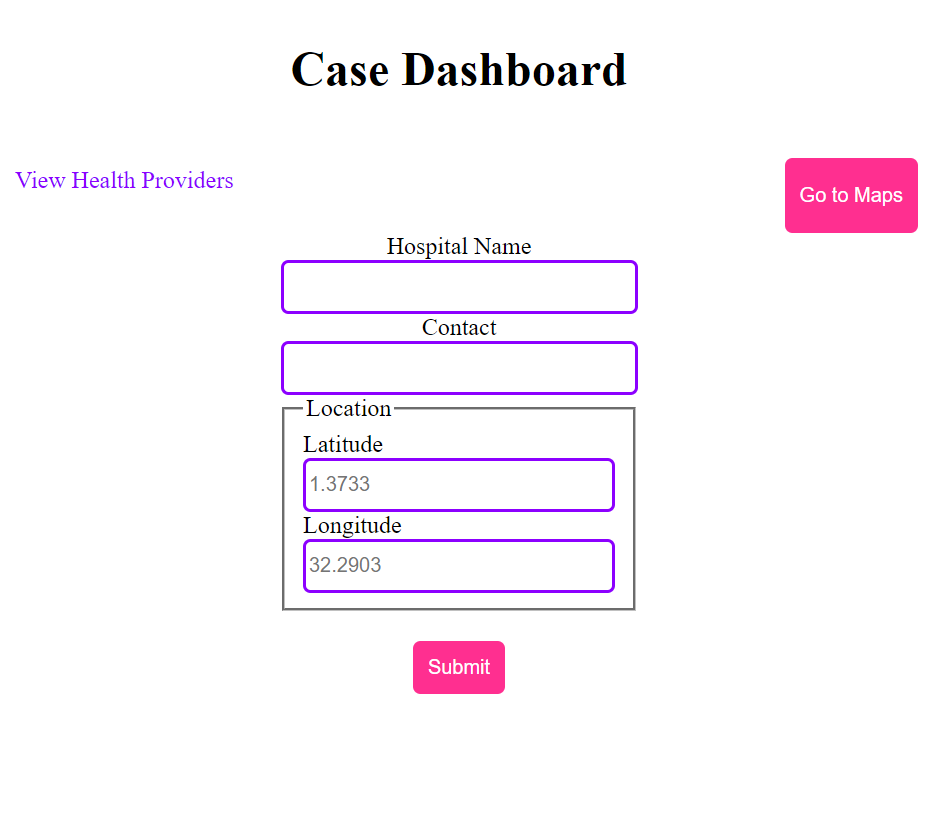

# To-Do-List

This is a dashboard for the Case MedInsurance app. The dashboard is used to enter hospital names as well as coordidates and they are entered into the database. The font end is built with JavaScript html and css and bundled with webpack. It connects to the firebase backend.

## Built With

- HTML
- CSS
- Javascript
- webpack

## Getting Started
To get the content of this project locally you need to run this command in your terminal:
- git clone your https://github.com/matovu-farid/case-dashboard.git
- cd project case-dashboard

### Deployment
This project is deployed on a github page on the link below:
- https://matovu-farid.github.io/case-dashboard/
## Author

👤 **Matovu Farid Nkoba**

- GitHub: [@matovu-farid](https://github.com/matovu-farid)
- Twitter: [@matovu100](https://twitter.com/matovu100)
- LinkedIn: [matovu-farid](https://www.linkedin.com/in/matovu-farid-48b80257)

## 📝 License

This project is [MIT](./MIT.md) licensed.
